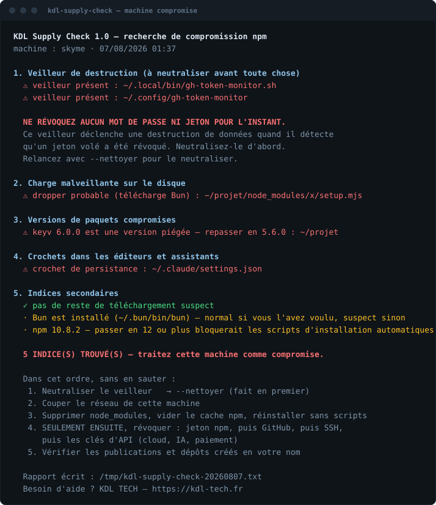
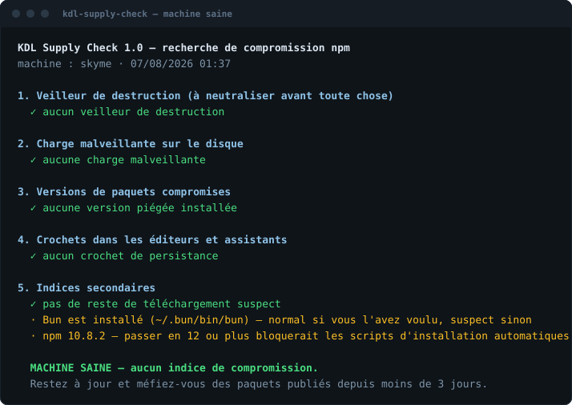

**Français** · [English](README.en.md)

# KDL Supply Check

Détecteur de compromission npm — famille **Shai-Hulud / ChainDrop**.

Un seul fichier, aucune dépendance, aucun appel réseau. Il regarde votre machine et vous
dit si le ver y est passé.

```bash
curl -fsSL https://raw.githubusercontent.com/Kdl-Tech/kdl-supply-check/main/kdl-supply-check.sh -o kdl-supply-check.sh
less kdl-supply-check.sh      # lisez-le avant de le lancer. Toujours.
bash kdl-supply-check.sh
```



<sub>Sortie réelle du script sur une machine de test volontairement infectée.</sub>

---

## L'erreur qui coûte cher

Ces vers déposent un **veilleur** — un « dead man's switch ». Il surveille le jeton GitHub
volé, et **quand vous le révoquez, il déclenche la destruction de vos données**.

Le réflexe naturel — « je suis infecté, je change tous mes mots de passe » — est
exactement ce qui fait sauter la charge.

**KDL Supply Check cherche ce veilleur en premier et vous arrête avant que vous touchiez à
quoi que ce soit.** C'est la raison d'être de cet outil : dans cette attaque, l'ordre des
opérations compte plus que la détection elle-même.

L'ordre sûr, que le script vous rappelle s'il trouve quelque chose :

1. neutraliser le veilleur,
2. couper le réseau de la machine,
3. nettoyer `node_modules` et le cache npm,
4. **seulement ensuite** révoquer les jetons — npm, GitHub, SSH, clés d'API,
5. vérifier les dépôts et publications créés en votre nom.

## Ce qu'il cherche

| | |
|---|---|
| **Le veilleur** | `gh-token-monitor` — service systemd, agent launchd, scripts déposés |
| **La charge** | par empreinte SHA-256, pas par nom de fichier |
| **Les paquets piégés** | `keyv` 6.0.0, `flat-cache` 6.1.24, `file-entry-cache` 11.1.6, `cacheable-request` 13.0.20, `cacheable` 2.5.1, `cache-manager` 7.2.10, `ecto` 5.0.1 |
| **La persistance** | crochets dans `.claude/settings.json`, `.vscode/tasks.json`, fichiers déposés |
| **Les traces** | restes de téléchargement Bun, version de npm |

## Pourquoi l'empreinte et pas le nom

Le ver s'appelle `Math_Symbol.js`. Un paquet parfaitement légitime —
`regenerate-unicode-properties` — contient un fichier du **même nom exact**.

Un détecteur qui cherche par nom déclenche une panique injustifiée sur une machine saine.
Ici la comparaison porte sur l'empreinte SHA-256 : le fichier légitime pèse environ 1 Ko,
la charge en pèse plus de 700. Les fichiers au nom trompeur sont comptés à part et
signalés comme tels.

Sur une machine propre, le script le dit sans détour :



## Usage

```bash
./kdl-supply-check.sh              # analyse seule — ne modifie rien
./kdl-supply-check.sh --nettoyer   # neutralise le veilleur, conserve les preuves
./kdl-supply-check.sh --silencieux # sortie courte, pour la supervision
```

Codes de sortie : `0` machine saine, `2` indices trouvés. Utilisable en cron ou en
supervision.

Par défaut il analyse votre dossier personnel. Pour viser ailleurs :

```bash
KDL_SCAN_PATHS="/srv /opt/apps" ./kdl-supply-check.sh
```

Sur un parc entier, par SSH :

```bash
for m in poste1 poste2 serveur; do
  echo "── $m"; ssh "$m" 'bash -s' < kdl-supply-check.sh
done
```

`--nettoyer` ne supprime pas le veilleur : il l'arrête, le désactive, puis **renomme son
dossier en `.preuve-<horodatage>`**. Vous gardez de quoi analyser l'incident.

## Ce qu'il ne fait pas

Il ne remplace ni un antivirus ni un audit complet. Il cherche **les traces connues d'une
famille précise de vers npm**, rien d'autre. Une machine déclarée saine par ce script peut
être compromise autrement.

Il ne révoque aucun jeton et ne touche jamais à vos mots de passe — c'est à vous de le
faire, dans l'ordre, et seulement après avoir neutralisé le veilleur.

## Compatibilité

Bash 4+ — Linux, macOS, WSL. Rien à installer.

## Contribuer

Une nouvelle vague arrive avec de nouvelles empreintes ? Ouvrez une *issue* avec la source
publique de l'indicateur. Les signatures vivent en haut du script, dans `HASHES_CONNUS` et
`PAQUETS_PIEGES` — deux listes lisibles, faciles à compléter.

## Licence

MIT. Prenez-le, modifiez-le, intégrez-le à vos outils. Un détecteur de sécurité n'a
d'intérêt que s'il circule.

---

Écrit par [**KDL TECH**](https://kdl-tech.fr) après avoir audité un parc entier la nuit de
l'attaque du 4 août 2026. Les six machines étaient saines — mais vérifier a pris des
heures, et personne ne devrait avoir à refaire ce travail à la main.

Maintenance informatique, développement, sécurité — Guadeloupe et à distance.
